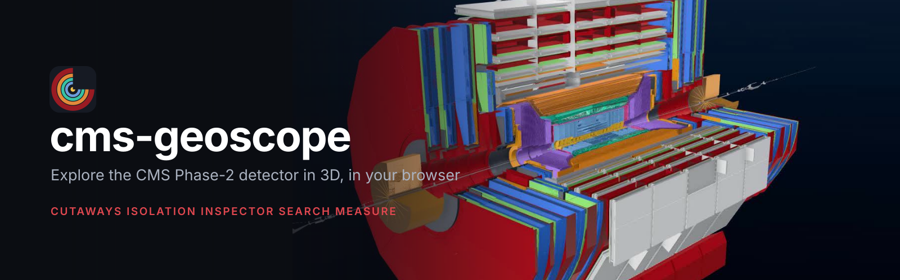
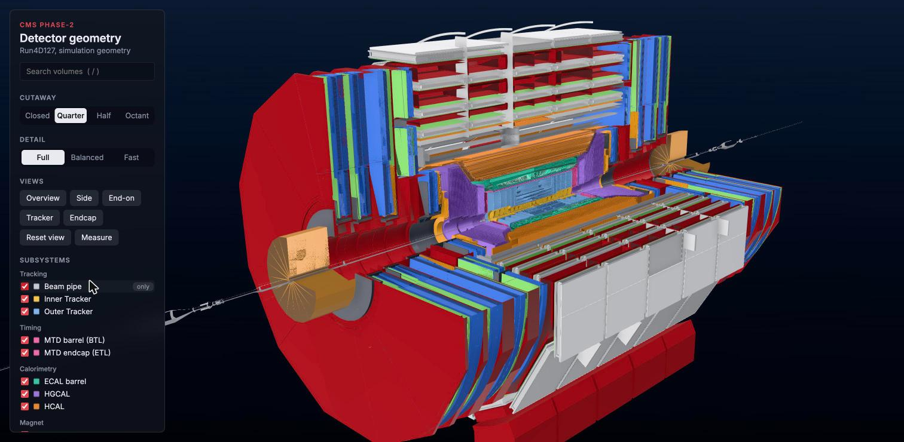
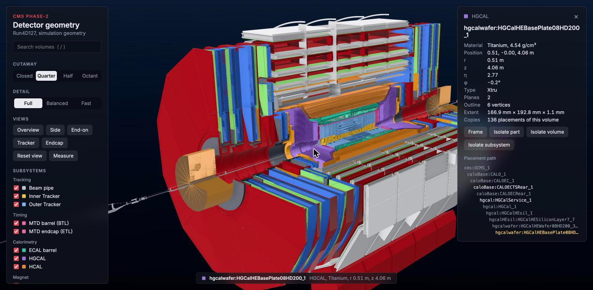

<p align="center">
  <a href="https://cms-geoscope.rishiraj.ch"></a>
</p>

<p align="center">
  <a href="https://github.com/rshrj/cms-geoscope/actions/workflows/ci.yml"></a>
  <a href="https://cms-geoscope.rishiraj.ch"></a>
  <a href="LICENSE"></a>
  <a href="https://github.com/rshrj/cms-geoscope/commits/main"></a>
  <a href="https://github.com/rshrj/cms-geoscope/issues"></a>
  
  
  <a href="CONTRIBUTING.md"></a>
</p>

<p align="center">
  <b><a href="https://cms-geoscope.rishiraj.ch">Live demo</a></b> &nbsp;|&nbsp;
  <a href="#features">Features</a> &nbsp;|&nbsp;
  <a href="#quick-start">Quick start</a> &nbsp;|&nbsp;
  <a href="#exporting-the-geometry">Geometry export</a> &nbsp;|&nbsp;
  <a href="#how-it-works">How it works</a> &nbsp;|&nbsp;
  <a href="#roadmap">Roadmap</a> &nbsp;|&nbsp;
  <a href="CONTRIBUTING.md">Contributing</a>
</p>

An interactive 3D model of the **CMS Phase-2 detector** (Run 4, scenario D127), built from
the CMSSW simulation geometry. Open it, cut the detector open, pick out a subsystem, click any
part to see what it is made of and where it sits, or search for a volume by name. It runs
entirely in the browser with [three.js](https://threejs.org); there is no server component.

> **Not an official CMS tool.** This is an independent project. It is not developed, endorsed or
> maintained by the CMS Collaboration or CERN. It reads publicly available CMSSW geometry
> descriptions and has not been validated against CMS's own detector displays.

<p align="center">
  <a href="https://cms-geoscope.rishiraj.ch"></a>
</p>

## Features

- **Cutaways:** closed, quarter, half or octant, with cut faces shaded as solid material.
- **Subsystems:** toggle each one, or press "only" to keep just that subsystem and add more back.
- **Isolation:** show one part with everything inside it, every copy of a volume, or a whole subsystem.
- **Inspector:** click or hover a part for its material, density, position (r, z, η, φ), shape,
  number of copies and full placement path, plus the nearest reco DetId.
- **Search:** fuzzy search over about 26,000 volume names, including the familiar TBPX, TFPX and TEPX names.
- **Measure:** click two points for the distance, its x/y/z parts and the change in radius.
- **Share links:** the address bar always holds the exact view (camera, cut, visibility, isolation,
  measurements), so any link reproduces it.
- **Detail levels:** Full, Balanced and Fast, to trade image quality for speed on lighter machines.
- **Fast:** the 2.4 million placements are drawn with GPU instancing and merged meshes, and the served data is gzip-compressed (298 MB down to 79 MB).

<p align="center">
  
</p>

## Quick start

Requires Node 22 or newer.

```sh
npm install
npm run data      # geometry/*.root -> public/data  (needs the ROOT files, see below)
npm run dev       # http://localhost:5173
```

The generated data (about 280 MB) and the ROOT files are not in the repository. To
produce the ROOT files, run `npm run export-geometry`, which drives CMSSW in a VM
(see [Exporting the geometry](#exporting-the-geometry)). `npm run build` followed by
`npm run preview` serves the compiled app.

## Exporting the geometry

The viewer reads ROOT files produced by CMSSW's Fireworks geometry dumps. They are not in
the repository, so you generate them once (about 1.5 minutes plus a first-time setup).

```sh
npm run export-geometry                          # D127, all three products
cmssw/export-geometry.sh -g D110 -p sim          # another scenario, sim file only
cmssw/export-geometry.sh -r CMSSW_20_1_X_2026-09-25-2300   # another release
```

**Requirements.** The script expects the [cmssw-workspace](https://github.com/rshrj/cmssw-workspace)
Lima VM to be running (`cmsvm shell` opens it), reachable over ssh as `lima-cmssw`. To use
a differently named instance, set `CMSSW_LIMA_INSTANCE`. It needs network access to CVMFS
inside the VM, and the `reco` products also read the conditions database.

**What it does.**

1. Builds a pristine SCRAM area for the release at `~/work/geom-export/<release>` in the VM.
   It refuses to run in an area that has checked-out packages, so results always come from
   the stock release. Nothing else in the VM is touched.
2. Runs the stock `dumpSimGeometry_cfg.py` and `dumpRecoGeometry_cfg.py` configs.
3. Copies the results into `geometry/`, together with logs and a `manifest.txt` that records
   the release, architecture, global tag, file sizes and hashes, and the number of
   error lines per log.

| Flag | Meaning                                               | Default                        |
| ---- | ----------------------------------------------------- | ------------------------------ |
| `-r` | CMSSW release                                         | `CMSSW_20_1_X_2026-09-13-2300` |
| `-a` | SCRAM architecture                                    | `el9_aarch64_gcc14`            |
| `-g` | geometry scenario                                     | `D127`                         |
| `-p` | products, comma separated: `sim`, `reco`, `tgeo-reco` | all three                      |

| Product | File | Role |
| ---------------------------------------------------------- | ---------------------------------------------------------- |
| `main.ts` | Assembles the app and runs the render loop |
| `stage.ts`, `views.ts`, `quality.ts` | Renderer and post-processing, camera flights, detail levels |
| `input.ts`, `link.ts` | Mouse and keyboard, address-bar sync |
| `data.ts` | Fetches and unpacks the (compressed) data files |
| `detector.ts` | Builds meshes, applies cuts and isolation |
| `looks.ts` | Subsystem colours and materials, cut-cap shader |
| `tree.ts`, `picker.ts`, `inspector.ts`, `ui.ts` | Placement tree, CPU ray picking, info card, side panel |
| `search.ts`, `measure.ts`, `share.ts`, `detids.ts` | Search, measuring, view links, DetId lookup |

## Development

```sh
npm run check     # typecheck, lint, format check and tests
npm run format    # apply Prettier
```

Source lives in `src/`, tests in `tests/` (Vitest). TypeScript is pinned to 6.0
because `typescript-eslint` does not support 7.x yet.

## Deploying

The app is static, so any static host works. The generated data is large (about 300 MB), which
is why `npm run build` also gzips everything in `dist/data` (about 80 MB afterwards) and writes
`dist/data/compressed.json`, an index the viewer uses to fetch and unpack the files in the
browser. The step is safe to re-run, checks every file by decompressing it before removing the
original, and does nothing when there is no data. The dev server keeps serving the raw files.

```sh
npm run build          # type-check, bundle, compress the data
npm run verify-build   # re-check every compressed file against the index
npm run preview        # try the deployed form locally
npm run deploy         # build, verify, then upload dist/ with the Vercel CLI (first run asks you to log in)
```

The data is generated on your machine and is not in the repository, so deploys are made from
a local build rather than by CI. The live site is a Vercel project with its Git integration
turned off on purpose: a build from the repository has no data and would break the site. Any other static host works the same way: upload `dist/`.
Because the browser decompresses the files itself, the host does not need to compress them.

## Roadmap

Planned features are tracked as [issues](https://github.com/rshrj/cms-geoscope/issues),
grouped by label: `physics`, `viewing`, `output`, `usability` and `geometries`. Issues
labelled [`next-up`](https://github.com/rshrj/cms-geoscope/labels/next-up) are planned first,
because they need no new data. Small ones are labelled
[`good first issue`](https://github.com/rshrj/cms-geoscope/labels/good%20first%20issue).
Ideas and requests are welcome.

## Known limits

- The DetId shown for a part is the nearest reco element by position, not an exact link.
- HGCAL cells are not in the DetId table.
- The viewer draws the simulation geometry only; the reco TGeo file is not used.

## Contributing

Bug reports, ideas and pull requests are welcome; see [CONTRIBUTING.md](CONTRIBUTING.md). Good
places to start are the issues labelled
[`good first issue`](https://github.com/rshrj/cms-geoscope/labels/good%20first%20issue).

## Acknowledgements

Built on the shoulders of [CMSSW](https://github.com/cms-sw/cmssw) and its Fireworks geometry dumps,
[JSROOT](https://github.com/root-project/jsroot) for reading ROOT files, [three.js](https://threejs.org),
[N8AO](https://github.com/N8python/n8ao) for ambient occlusion, and [Vite](https://vite.dev).

## License

[MIT](LICENSE) &copy; 2026 Rishi Raj
